<div align="center">
  
</div>

<br/>

**Software MRI** is a diagnostic engine that scans any GitHub repository and produces an interactive 3D map of your codebase's structural health — surfacing circular dependencies, complexity hot zones, dead code, and technical debt before they become operational risk.

---

## Features

- **Cross-sectional 3D map** — interactive force-directed graph of every module in your repository, color-coded by structure, complexity, or debt layer
- **Circular dependency detection** — identifies cycles in your import graph and flags them with high signal
- **Cyclomatic complexity analysis** — per-module complexity scoring with hot zone overlays (high churn × high complexity)
- **Technical debt registry** — findings with severity scoring, tag classification, and last-modified tracking
- **Health index** — composite score (0–100) with grade and natural-language computed readout
- **Risk surface view** — top signals ranked by risk score with one-click navigation to the source module
- **Export** — download full analysis as JSON for CI/CD pipeline integration

---

## Architecture

```
┌─────────────────────────────────────────────────────┐
│                    Frontend (Vite)                    │
│  React · MUI · Radix UI · Tailwind CSS · Three.js   │
│  3D Force Graph · Recharts · Vaul · Sonner           │
└─────────────────────┬───────────────────────────────┘
                      │  /api (proxy → :3001)
                      ▼
┌─────────────────────────────────────────────────────┐
│               Backend (Express · TypeScript)          │
│  simple-git (clone) → madge (import graph) →         │
│  complexity heuristics → debt scanner → diagnosis    │
└─────────────────────────────────────────────────────┘
```

| Layer | Stack |
|-------|-------|
| Frontend | React 18, Vite 6, TypeScript, MUI 7, Radix UI, Tailwind CSS 4, Three.js |
| Visualization | react-force-graph-3d, recharts, embla-carousel |
| Backend | Express 4, TypeScript, tsx |
| Analysis | simple-git, madge (import graph), custom complexity/debt heuristics |
| Package Manager | pnpm (workspace monorepo) |

---

## Quick Start

```bash
pnpm install

# Terminal 1 — Backend
cd backend && pnpm dev

# Terminal 2 — Frontend
pnpm dev
```

Open `http://localhost:5173` in your browser. Paste a GitHub URL (e.g. `https://github.com/vercel/next.js`) and click **Run scan**.

> **Tip:** The app loads a demo fixture on first visit so you can explore the UI immediately without running a scan.

---

## Project Layout

```
├── src/                        # Frontend source
│   ├── app/
│   │   ├── App.tsx             # Main application shell
│   │   ├── components/
│   │   │   ├── graph-3d.tsx    # 3D force-directed graph (Three.js)
│   │   │   ├── EmptyResults.tsx
│   │   │   └── ui/             # shadcn-style primitives
│   │   └── lib/
│   │       └── analysis.ts     # Enrichment & scoring logic
│   ├── imports/                # Demo fixture data
│   ├── styles/                 # Global CSS
│   └── main.tsx                # Entry point
├── backend/                    # Express API server
│   └── src/
│       ├── index.ts            # Server entry
│       ├── router.ts           # API routes
│       ├── pipeline.ts         # Scan pipeline orchestration
│       └── types.ts            # Shared types
├── vite.config.ts
└── pnpm-workspace.yaml
```

---

## API Endpoints

| Method | Path | Description |
|--------|------|-------------|
| `POST` | `/api/scan` | Initiate a new scan (`{ repoUrl }`) |
| `GET` | `/api/scan/:id/status` | Poll scan status (stage, progress) |
| `GET` | `/api/scan/:id/result` | Retrieve completed scan result |

---

## License

See [ATTRIBUTIONS.md](./ATTRIBUTIONS.md) for third-party license information.

<br/>

<div align="center">
  <sub>
    Built with React · Three.js · Express · TypeScript
    <br/>
    <code>STATIC ANALYSIS ONLY · DATA REMAINS LOCAL</code>
  </sub>
</div>
